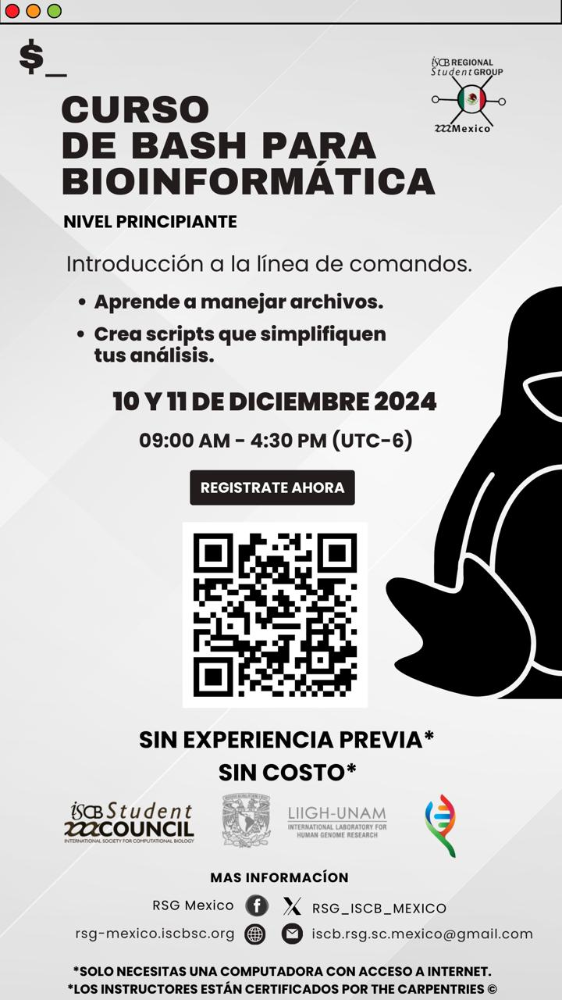

# Curso de Unix Shell

¡Te damos la bienvenida a aprender Bash Shell de la mano del RSG-Mexico!  💻🧬🧫  

Fechas: 10 y 11 diciembre 2024 (9 am - 4:30 pm UTC-6, Ciudad de Mexico)

**Nivel principiante**

## Sobre nosotros 🔥

El Regional Student Group, [RSG-México](https://rsg-mexico.iscbsc.org/), es un grupo de estudiantes de posgrado que se dedica a impulsar y motivar la difusión de áreas como biología computacional y bioinformática, generando un espacio seguro que permita el aprendizaje y discusión de temas en dichas áreas.

En esta ocasión, nos entusiasma la idea de que te interese el curso introductorio de Bash Shell para Bioinformática!

### Instructores

- [Evelia Coss](https://eveliacoss.github.io/) * - Posdoctoral LIIGH, Coordinadora de los [VieRnes de Bioinformática en el LIIGH-UNAM](https://viernesbioinformatica.github.io/), correo: ecoss@liigh.unam.mx
- Aarón Espinosa Jaime - Estudiante de maestria, Cinvestav-LANGEBIO.

### Helpers

- Daniel Chávez  - Profesor invitado, UAGro.
- Camilo Pérez - Estudiante de doctorado, Cinvestav-LANGEBIO.
- Abel Lovaco Flores - Estudiante de maestria, Cinvestav-Irapuato.
- Israel Aguilar - Posdoctoral Tec-Monterrey, Coordinador de los [VieRnes de Bioinformática en el LIIGH-UNAM](https://viernesbioinformatica.github.io/).
- Mariana Devon - Estudiante de maestría, UAM.
- Andrés Arredondo - Ciencias Agrogenómicas, CCM-UNAM.

**Curso registrado en The Carpentries.**

* Los instructores estan certificados por [The Carpentries](https://carpentries.org/).

## Sobre el curso 📙

En este curso aprenderás los fundamentos de la línea de comandos, una herramienta esencial para el manejo eficiente de archivos y la automatización de análisis en bioinformática.

### Objetivos del curso 🔭

- Dominar los comandos básicos para trabajar con archivos y directorios.
- Crear scripts personalizados que simplifiquen y aceleren tus tareas de análisis.
- No necesitas experiencia previa, solo curiosidad por aprender y explorar nuevas herramientas para potenciar tus habilidades bioinformáticas.

Si tienes alguna duda o comentario, estamos al pendiente en nuestras redes sociales que aparecen abajo.

##  Inscripción

¡Inscríbete ahora y lleva tu análisis al siguiente nivel!

Completa el: [Google form](https://docs.google.com/forms/d/e/1FAIpQLSec3mQzH-MOIQYDm-1n6AC0zQ3xP_GLDPpW2Gnou0W1tX9Auw/viewform)

## Contenido 📌

Pagina web: https://iscb-rsg-mexico.github.io/2024-12-10-Workshop-Bash/
Material: https://eveliacoss.github.io/Workshop_Bash2024/requisitos.html (por ajustar al material de Carpentry)
Leccion: https://swcarpentry.github.io/shell-novice-es/

## Patrocinadores

- International Society for Computational Biology (ISCB Student Council)
- Centro de Ciencias Matemáticas UNAM (CCM)
- [VieRnes de Bioinformática en el LIIGH-UNAM](https://viernesbioinformatica.github.io/)
- Laboratorio Internacional de Investigación sobre el Genoma Humano (LIIGH) UNAM

## Redes sociales del RSG-México

- Facebook: RSG-Mexico
- Email: iscb.rsg.sc.mexico@gmail.com
- X: @RSG_ISCB_Mexico 
- Canal: www.youtube.com/@RSG-Mexico

